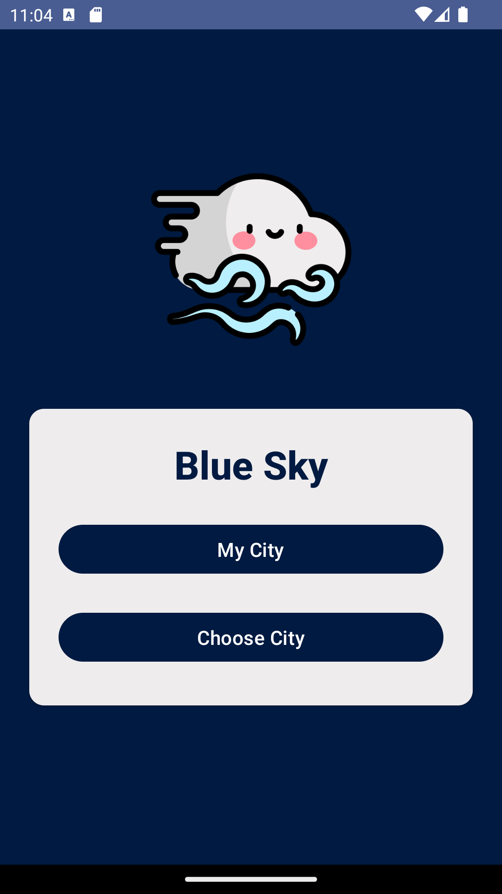

Blue Sky is a weather and pollution service app that shows some cities of Iran's weather and air quality.Blue Sky is developed with kotlin langauge as android programming course fourth project.

#### Amirkabir University of Technology - Fall 2023

    
    
    

